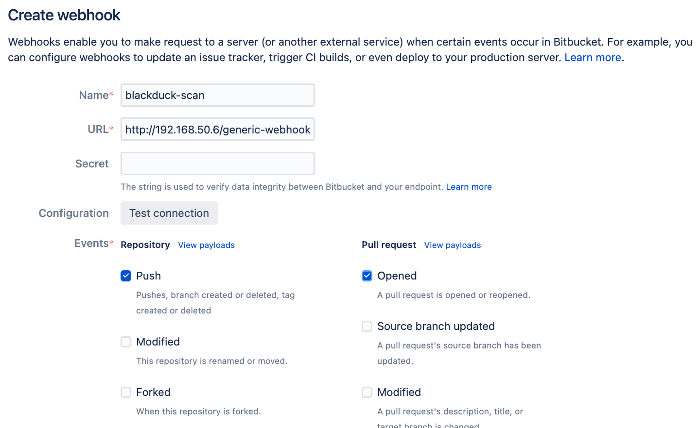

# Guide for Black Duck and BitBucket Data Center

## Introduction

The following guide describes how to set up a prototype integration between
Synopsys Black Duck and Atlassian BitBucket Data Center.

The integration will use the following components:

* The [Black Duck Direct Scan Action](https://github.com/synopsys-sig-community/blackduck-direct-scan-action) - An open source Python script that provides the key functionality
* A custom Jenkins pipeline (Example in this repo)
* A small driver script that runs from the Jenkins script and invokes the Direct Scan Action above (included in this repo) 

The following capabilities are provided:

### Trigger a Black Duck to run based on a BitBucket Git event (push or pull request)

BitBucket Data Center, unlike BitBucket Pipelines, does not provide orchestration
of builds or software testing. Instead, it has the ability to send a Webhook to
a platform that can provide orchestration services on it's behalf.

In order to trigger a Black Duck scan to run based on a BitBucket event, im this
guide we will use Jenkins as the receiving system where a custom configured
pipeline will run to unpack the payload, determine which repo to scan, perform the
scan, and finally write status back into BitBucket.


### Receive security testing feedback as Atlassian Code Insights on a pull request

[Atlassian Code Insights](https://confluence.atlassian.com/bitbucketserver/code-insights-966660485.html)
are a method for security testing tools to provide
feedback directly linked to a code change. Once the results are imported into
BitBucket, they can be viewed by developers without loading each proprietary tool,
and the reports can be used to block merges until policy is met.


### Receive security testing feedback as a comment on pull request

Code Insights provide a fully integrated way to view Black Duck results
within BitBucket, but each annotation is limited in scope in terms of what
content it can provide. It is not a long-format display.

Pull Request comments may be usd to pass further technical detail to the
developer.


### Block a merge from being completed until security policy is mey

BitBucket can be configured to block a merge to a repo if a code insights
report is not satisfied - if it is flagged as FAIL.


### Create pull requests to fix policy violations

If enabled, a pull request will be created automatically for any
Black Duck security policy violations with (default: short term) upgrade guidance
available.


## Setup

### 1. Set up a Jenkins pipeline job to receive webhooks

This integration can be used with pipeline jobs dedicated to a specific
project, but in this example we will show how to set up a generic job that
will receive a webhook, extract the project and repo information from the
payload, and perform the scan.

Configure a Jenkins pipeline jon with the following options:

* Name: blackduck-scan
* Build Triggers: Generic Webhook Trigger
  * Post content parameters:
    * Variable: JSONPATH
    * Expression: $
    * Select JSONPATH radio button
  * Token: blackduck-scan
  * Cause: BitBucket Trigger: Project ${JSONPATH_pullRequest_fromRef_repository_project_key} Repo ${JSONPATH_pullRequest_fromRef_repository_slug} PR#${JSONPATH_pullRequest_id}
* Definition: Pipeline Script

The Jenkinsfile in this repo provides an example. Please note the variables that
need to be configured, it cannot be run as-is.

The job must be cnofigured to execute on build agents with the necessary
build tools (e.g. NPM, Maven) installed as well as the scripts in the next
section.

### 2. Set up the integration scripts

A small set of scripts must be installed on the Jenkins build agents that
will be servicing the generic events for multiple projects.

```
# Download the Black Duck Direct Scan Action
git clone -b bitbucket-data-center https://github.com/synopsys-sig-community/blackduck-direct-scan-action
# Install the modules into local python environment
pip3 install ./blackduck-direct-scan-action
# Download the wrapper script (this repo)
git clone https://github.com/jcroall/blackduck-bitbucket-data-center
```

Note the location where you have installed the scripts and modify the Jenkinsfile
pipeline to call them from the appropriate location.


### 3. Set up BitBucket to trigger the WebHooks

You can interactively set up a Webhook on a repository by selecting Repository Settings -> Webhooks.

* Name: blackduck-scan
* URL: http://JENKINS-SERVER-HERE/generic-webhook-trigger/invoke?token=blackduck-scan
* Events:
  * Repository:
    * Push
  * Pull Request:
    * Opened

For setting up webhooks at scale, it is recommended to use the BitBucket Data Cemter
API. This BitBucket administration task is beyond the scope of this README.



### 4. Set up BitBucket to block merges 

You can interactively set up a Code Insights policy by selecting Repository Settings -> Code Insights.

* Required report: com.synopsys.blackduck.report
* Required status: Must pass
* Annotation requirements: *Choose your policy here*


