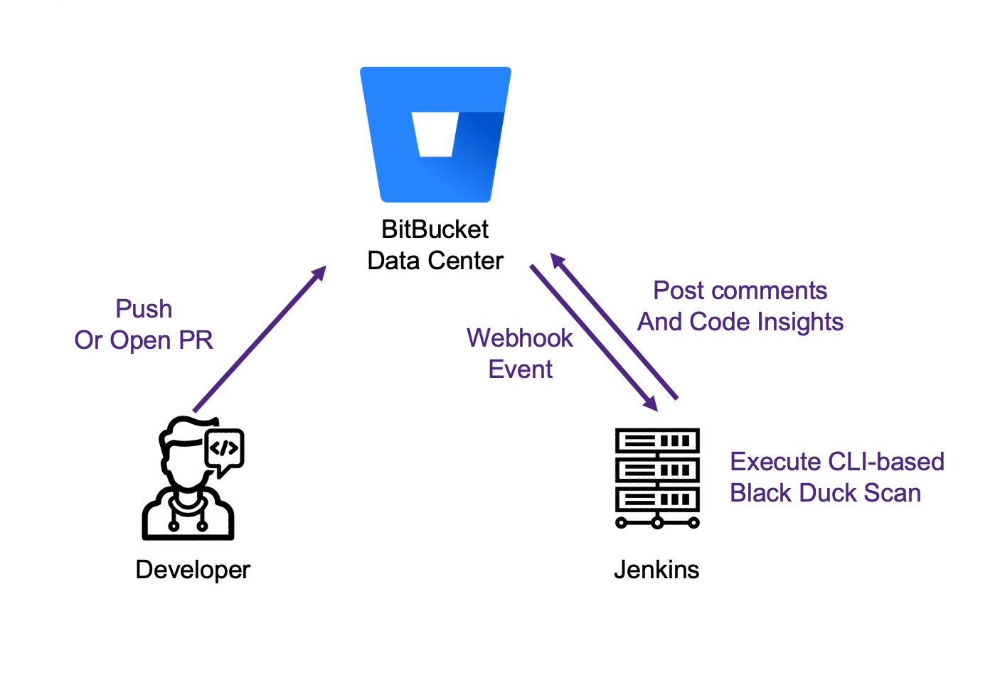
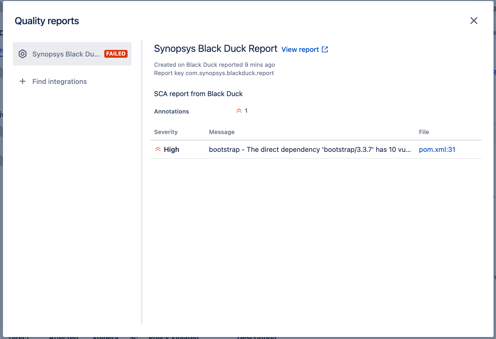
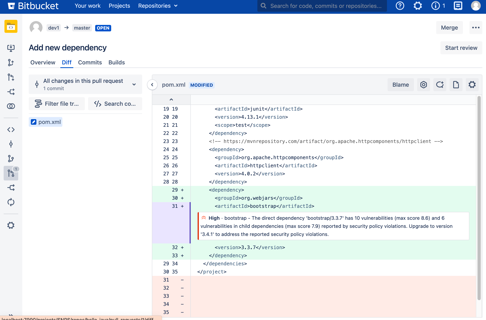
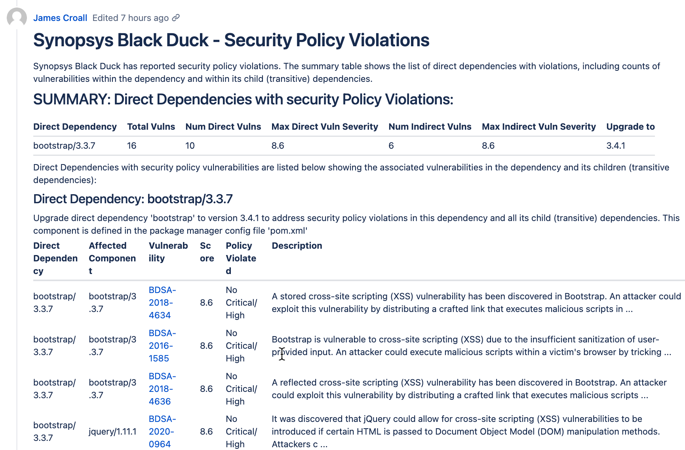
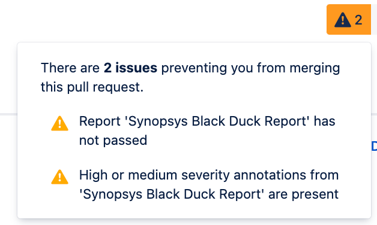
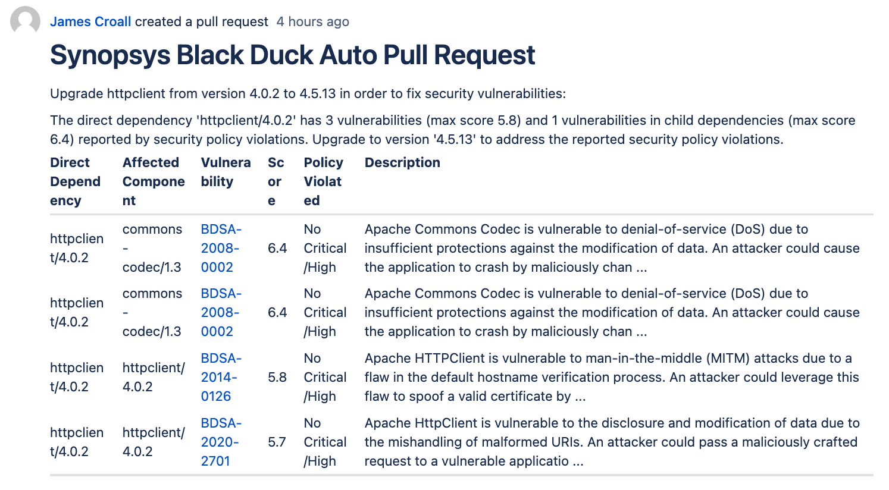
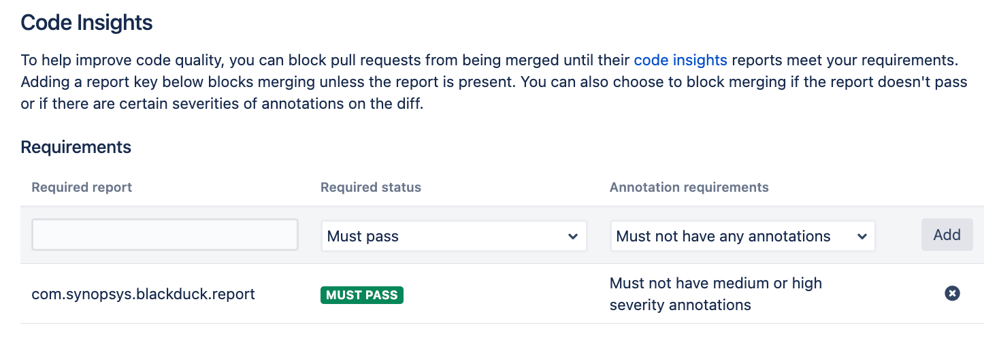

# Guide for Black Duck and BitBucket Data Center

## Introduction

The following guide describes how to set up a prototype integration between
Synopsys Black Duck and Atlassian BitBucket Data Center.

The integration will use the following components:

* The [Black Duck Direct Scan Action](https://github.com/synopsys-sig-community/blackduck-direct-scan-action) - An open source Python script that provides the key functionality
* A Jenkinsfile recipe (example included in this repo)
* A small driver script that runs from the Jenkins script and invokes the Direct Scan Action above (included in this repo) 

The following capabilities are provided:

### Trigger a Black Duck to run based on a BitBucket Git event (push or pull request)

BitBucket Data Center, unlike BitBucket Pipelines, does not provide orchestration
of builds or software testing. Instead, it relies on a CI system like Jenkins to provide
the tool orchestration and execution.

This guide will use the [BitBucket Branch Source Plugin](https://github.com/jenkinsci/bitbucket-branch-source-plugin)
to receive events from BitBucket and execute the Black Duck scans. 



The [example Jenkinsfile](Jenkinsfile.txt) included in this repo shows an example of how to 
detect whether the build is for a merge from a development branch to a production branch and run a
Black Duck rapid scan, or alternatively if it's a push to a main branch (e.g. integration after the PR) to run
a full intelligent scan which will update the database.

### Receive security testing feedback as Atlassian Code Insights on a pull request

[Atlassian Code Insights](https://confluence.atlassian.com/bitbucketserver/code-insights-966660485.html)
are a method for security testing tools to provide
feedback directly linked to a code change. Once the results are imported into
BitBucket, they can be viewed by developers without loading each proprietary tool,
and the reports can be used to block merges until policy is met.





### Receive security testing feedback as a comment on pull request

Code Insights provide a fully integrated way to view Black Duck results
within BitBucket, but each annotation is limited in scope in terms of what
content it can provide. It is not a long-format display.

Pull Request comments may be usd to pass further technical detail to the
developer.



### Block a merge from being completed until security policy is mey

BitBucket can be configured to block a merge to a repo if a code insights
report is not satisfied - if it is flagged as FAIL.



### Create pull requests to fix policy violations

If enabled, a pull request will be created automatically for any
Black Duck security policy violations with (default: short term) upgrade guidance
available.



## Setup

### 1. Install the necessary scripts in your Jenkins build agents

A small set of scripts must be installed on the Jenkins build agents.

The [Black Duck Direct Scan Action](https://github.com/synopsys-sig-community/blackduck-direct-scan-action)
is a Python script that provides the intelligence for running Black Duck and leaving feedback in the SCM system.
This is installed like any other Python module. For example:

```
# Download the Black Duck Direct Scan Action
git clone -b bitbucket-data-center https://github.com/synopsys-sig-community/blackduck-direct-scan-action
# Install the modules into local python environment
pip3 install ./blackduck-direct-scan-action
```

Note that this is using a specific branch of the script that has been extended to support BitBucket Data Center.
This could also be copied to an internal artifact repository and installed from there.

The [blackduck-scan.py](blackduck-scan.py) script from this repo will provide the interface between Jenkins
and the Black Duck Direct Scan Action. Copy this script to a suitable location on the build agent image. Again, 
this could be copied to an internal artifact repository.

### 2. Set the necessary credentials in Jenkins

It is likely that you already have BitBucket credentials configured in Jenkins, but if not they will need to be established.
You will also need to set up Black Duck credentials. These are both "secret text" credentials.

The included [Jenkinsfile](Jenkinsfile.txt) uses the following credentials IDs:
* bitbucket-token
* blackduck-token

### 3. Set up your Jenkinsfile to call the script

This guide assumes you are already using the [BitBucket Branch Source Plugin](https://github.com/jenkinsci/bitbucket-branch-source-plugin).
This Jenkins plugin will provide the ability to trigger a scan from BitBucket, and provides all of the runtime data
needed like the project name, repo name, pull request ID, etc.

The [Jenkinsfile](Jenkinsfile.txt) included in this repo shows an example of how to invoke the Black Duck scans
from Jenkins, calling the scripts above.

The Jenkinsfile in this repo provides an example. Please note the variables that
need to be configured, it cannot be run as-is. You will need to copy the necessary bits to your own
Jenkinsfile(s).

### 4. Set up BitBucket to block merges 

You can interactively set up a Code Insights policy by selecting Repository Settings -> Code Insights.

* Required report: com.synopsys.blackduck.report
* Required status: Must pass
* Annotation requirements: *Choose your policy here*




